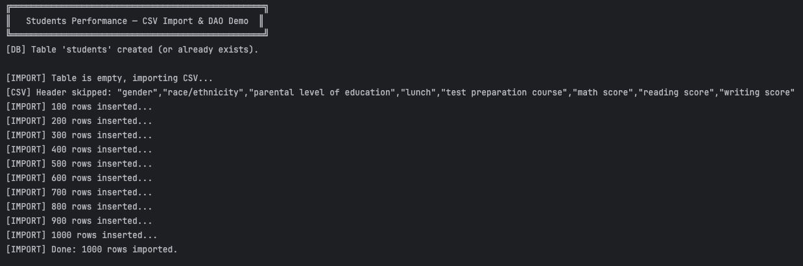
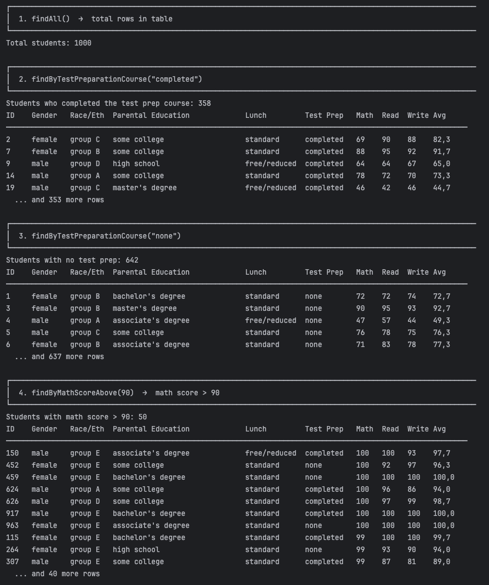
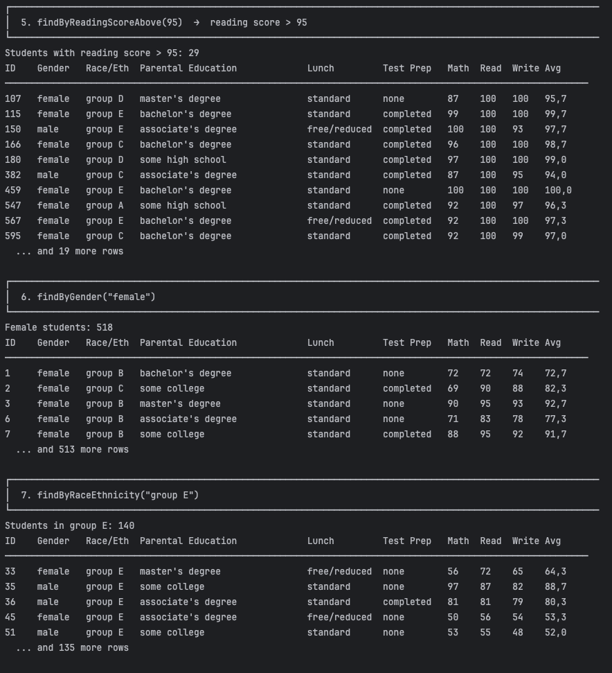
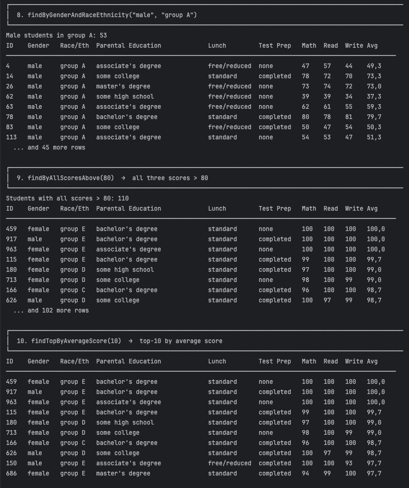
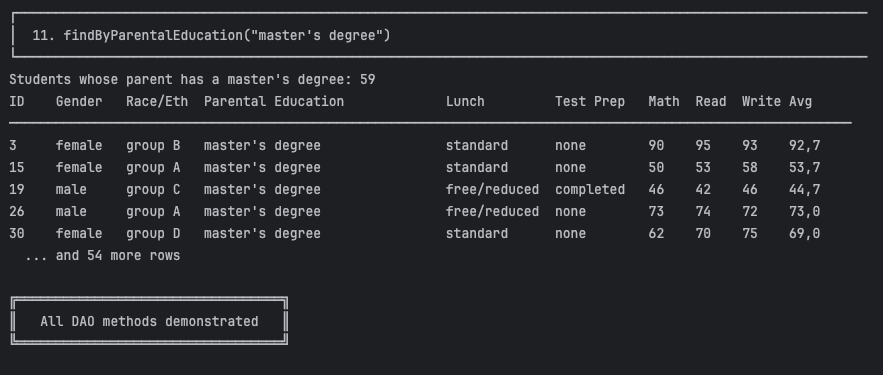

# SQL. Импорт CSV и реализация DAO

<p align="center">
  
  
  
  
</p>

Java + JDBC проект: импорт реального датасета [Students Performance in Exams](https://www.kaggle.com/datasets/spscientist/students-performance-in-exams) из CSV-файла в реляционную базу данных H2 и реализация слоя доступа к данным (DAO) с фильтрацией.

## Структура проекта

```
Practice_02-BD_SQL/
├── StudentsPerformance.csv          # датасет Kaggle (1000 строк)
├── pom.xml
├── README.md
├── screenshots/                     # скриншоты выполнения (этот README)
└── src/main/java/org/example/
    ├── Main.java                    # точка входа — импорт + демонстрация DAO
    ├── DatabaseManager.java         # фабрика соединений + CREATE TABLE
    ├── StudentImporter.java         # батчевый импорт CSV → БД (Задача 1)
    ├── CsvParser.java                # CSV-парсер с поддержкой кавычек (RFC-4180)
    ├── model/
    │   └── Student.java             # модель сущности
    └── dao/
        ├── StudentDao.java          # интерфейс DAO (10 методов фильтрации)
        └── StudentDaoImpl.java      # реализация на JDBC
```

## Задача 1 — Импорт CSV в базу данных

### Схема таблицы `students`

```sql
CREATE TABLE IF NOT EXISTS students (
    id                          INTEGER AUTO_INCREMENT PRIMARY KEY,
    gender                      VARCHAR(10)  NOT NULL,
    race_ethnicity              VARCHAR(20)  NOT NULL,
    parental_level_of_education VARCHAR(50)  NOT NULL,
    lunch                       VARCHAR(20)  NOT NULL,
    test_preparation_course     VARCHAR(20)  NOT NULL,
    math_score                  INTEGER      NOT NULL,
    reading_score               INTEGER      NOT NULL,
    writing_score               INTEGER      NOT NULL
);
```

### Как устроен импорт

`StudentImporter.importFromCsv()`:
1. Читает `StudentsPerformance.csv` построчно, пропуская заголовок.
2. Парсит каждую строку через собственный `CsvParser` (корректно обрабатывает значения в кавычках).
3. Вставляет данные через `PreparedStatement` — никакой конкатенации строк в SQL.
4. Группирует вставки в батчи по 100 строк (`addBatch()` / `executeBatch()`) внутри одной транзакции.
5. При ошибке — `rollback()`; строки с некорректным форматом (неверное число полей, нечисловой балл) пропускаются с предупреждением в консоль, не прерывая весь импорт.
6. Все ресурсы (`Connection`, `PreparedStatement`, `BufferedReader`) закрываются через `try-with-resources`.

### Скриншот: процесс импорта



Видно создание таблицы, построчный импорт с прогрессом по 100 строк и итог: **1000 из 1000 строк успешно импортированы**.

### Проверка количества записей

Сразу после импорта `findAll()` подтверждает результат (соответствует требуемому `SELECT COUNT(*) FROM students;`):

```
Total students: 1000
```

(см. верхнюю часть скриншота в разделе «Задача 2» ниже)

---

## Задача 2 — Реализация DAO и фильтрация

### Интерфейс `StudentDao`

10 методов фильтрации, реализованных в `StudentDaoImpl` с использованием `PreparedStatement` и `try-with-resources` во всех методах:

| Метод | Описание |
|---|---|
| `findAll()` | Все 1000 студентов |
| `findByTestPreparationCourse(course)` | `"completed"` → 358 строк / `"none"` → 642 строки |
| `findByMathScoreAbove(minScore)` | Балл по математике выше порога (сортировка по убыванию) |
| `findByReadingScoreAbove(minScore)` | Балл по чтению выше порога (сортировка по убыванию) |
| `findByGender(gender)` | `"female"` → 518 / `"male"` → 482 |
| `findByRaceEthnicity(group)` | По этнической группе A – E |
| `findByGenderAndRaceEthnicity(gender, group)` | Комбинированный фильтр; любой параметр может быть `null` |
| `findByAllScoresAbove(minScore)` | Все три балла выше порога |
| `findTopByAverageScore(limit)` | Топ-N студентов по среднему баллу |
| `findByParentalEducation(education)` | По уровню образования родителя |

### Архитектура реализации

- Все запросы — статичные SQL-шаблоны с `?`-плейсхолдерами, без единого случая конкатенации значений в строку запроса (защита от SQL-инъекций).
- Общая логика выполнения запроса и маппинга `ResultSet → Student` вынесена в приватный метод `queryList()`, использующий функциональный интерфейс `StatementPreparer` для связывания параметров — устраняет дублирование кода между методами.
- Комбинированный фильтр `findByGenderAndRaceEthnicity` безопасно обрабатывает `null`-параметры через делегирование на более простые методы, а не динамическое построение SQL.
- `Connection` передаётся в `StudentDaoImpl` через конструктор — DAO не управляет её жизненным циклом, что позволяет вызывающему коду контролировать границы транзакции.

### Демонстрация работы — `Main.java`

`runDaoDemo()` вызывает все 10 методов интерфейса и выводит результаты в виде читаемых таблиц.

#### Скриншоты: результаты фильтрации

**1–4. `findAll`, `findByTestPreparationCourse`, `findByMathScoreAbove`**



**5–7. `findByReadingScoreAbove`, `findByGender`, `findByRaceEthnicity`**



**8–10. `findByGenderAndRaceEthnicity`, `findByAllScoresAbove`, `findTopByAverageScore`**



**11. `findByParentalEducation`**



---

## Ключевые технические решения

- **`PreparedStatement` везде** — ни одного места с конкатенацией значений в SQL-строку, защита от SQL-инъекций.
- **`try-with-resources`** на каждом `Connection`, `PreparedStatement` и `ResultSet`.
- **Батчевая вставка** (100 строк на `executeBatch`) в рамках одной транзакции; `rollback()` при любой ошибке.
- **Защита от повторного импорта** — проверка `COUNT(*)` перед стартом импорта при повторных запусках.
- **Внедрение `Connection` через конструктор `StudentDaoImpl`** — вызывающий код управляет границами транзакции, без скрытого управления соединением внутри DAO.
- **Устойчивость к некорректным строкам CSV** — строки с неверным числом полей или нечисловыми баллами пропускаются с предупреждением, не прерывая весь импорт.
